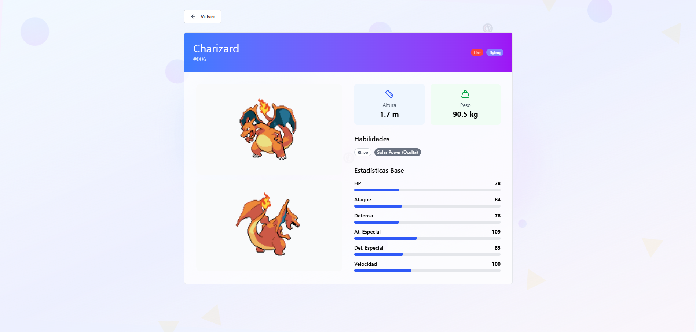

# PokéSearch

**PokéSearch** is a modern web application that allows users to search, explore, and discover Pokémon using the [PokéAPI](https://https://pokeapi.co/). It provides an intuitive interface for browsing Pokémon data, including images, types, abilities, and other stats.

## 🌟 Features

- 🔍 **Search Pokémon** by name or show all.
- 📄 **Detailed Pokémon profiles** showing sprites, types, abilities, stats, and more.
- 📊 **Pagination** for listing Pokémon in batches.
- 🎨 **Responsive UI** with modern design, optimized for desktop and mobile.
- ⚡ **Fast and lightweight**, powered by React and Vite.

## 🚀 Tech Stack

- **React** — Frontend framework
- **Vite** — Build tool
- **TypeScript / JavaScript** — Language
- **Tailwind CSS**
- **PokéAPI** — External data source

## 📦 Installation

Clone the repository:

```bash
git clone https://github.com/hgalarze/poke-search.git
cd poke-search
```

Install dependencies:

```bash
npm install
```

Customize the `.env` file (by default, it uses the PokéAPI base URL and pagination settings):

```bash
VITE_POKEMON_API_BASE_URL=https://pokeapi.co/api/v2/pokemon/
VITE_PAGINATION_ITEMS_PER_PAGE=20
VITE_PAGINATION_MAX_VISIBLE_PAGES=5
VITE_PAGINATION_DEFAULT_START_PAGE=1
```

Run locally:

```bash
npm run dev
```

## ⚙️ Configuration

You can configure some settings in the `.env` file:

- `VITE_POKEMON_API_BASE_UR` — API base URL
- `VITE_PAGINATION_ITEMS_PER_PAGE` — Number of Pokémon per page
- `VITE_PAGINATION_MAX_VISIBLE_PAGES` — Max visible pagination links in pagination controls
- `VITE_PAGINATION_DEFAULT_START_PAGE` — Default start page for pagination

## 🖼️ Screenshots




## 🙌 Acknowledgements

- [PokéAPI](https://Pokéapi.co/)  
- [React](https://reactjs.org/)  
- [Vite](https://vitejs.dev/)
